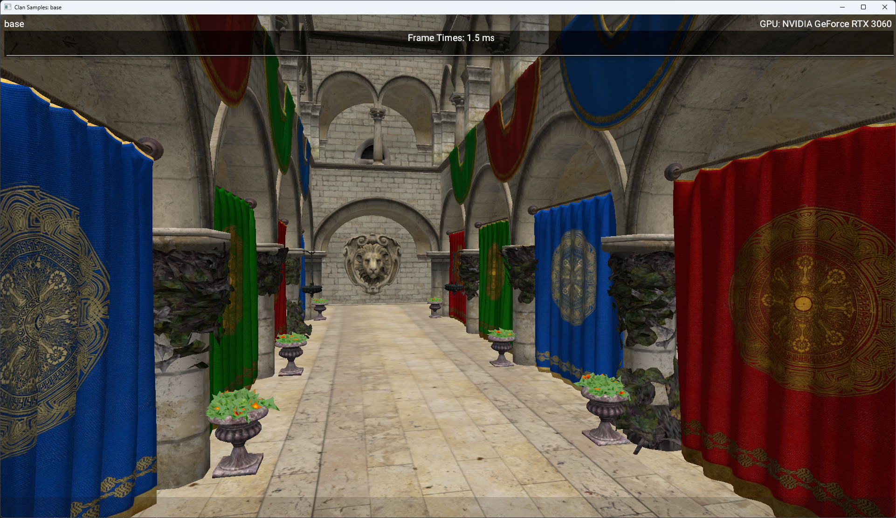
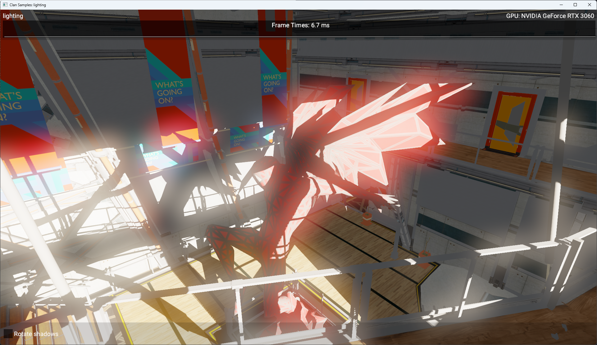

# clan_samples

For now, there are just two samples.

The base sample:



The lighting sample:




To build the project:

```bash
git clone https://github.com/Clannn/clan_samples.git
cd clan_samples
cmake . -Bbuild
cmake --build build --config Release
./clan_samples.exe
```


If you want to choose different sample:

```bash
./clan_samples.exe sample <sample_name>
```

eg:

```bash
./clan_samples.exe sample lighting
```

